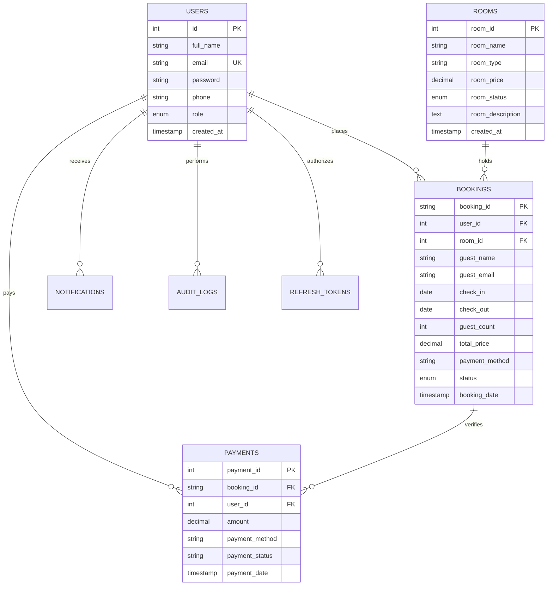

# 🏨 Advanced Hotel Management System (SARTE)

A secure, high-performance, full-stack Hotel Management System designed to streamline room discovery, reservations, analytics, and staff audit logs. The system features a modern, responsive Flutter application with glassmorphic visuals and a robust, secure Node.js REST API backed by a MySQL database.

---

## 🚀 Key Features

### 👤 User & Guest Experience
*   **Secure Authentication:** User signup, secure login with account lockout protection (5 failed attempts locks account for 15 mins), token-based persistent sessions, and a demo password-reset flow with OTP codes.
*   **Dynamic Room Search:** Browse and filter hotel suites by type, pricing range, search terms, and current availability status.
*   **Seamless Booking Flow:** Select rooms, choose dates (with calendar conflict/overlap checking), input guest details, and complete reservations.
*   **Interactive Notifications:** Live in-app notifications and alerts dynamically synced with booking confirmations and cancellations.
*   **Wallet & Payment Logs:** Log and record dummy digital payments (Credit Card, SARTE Wallet, UPI, etc.) for each booking.

### 🛡️ Admin & Staff Operations
*   **Unified Dashboard Metrics:** Visual graphs and counters monitoring total revenue, total rooms, booking statuses, active guests, and occupancies.
*   **Room Suite Inventory (CRUD):** Complete control for staff and admin to create, edit, update, or remove hotel suites from the catalog.
*   **User Directory & Permissions:** Secure role management (User, Staff, Admin) with granular permission checks.
*   **Staff Recruitment:** Admin can recruit new staff members and manage roles.
*   **System Audit Logging:** Automated activity logger capturing administrative tasks, updates, and bookings for strict compliance.

---

## 🛠️ Technologies & Packages Used

### 📱 Frontend (Mobile App)
*   **Core:** Flutter SDK, Dart
*   **State Management:** `provider` (version `^6.1.5+1`) for synchronous, clean state management across the UI.
*   **Networking:** `http` (`^1.6.0`) for making REST API calls to the Express backend.
*   **Local Storage:** `shared_preferences` (`^2.5.5`) for storing JWT authorization tokens locally.
*   **Design & Styling:**
    *   `google_fonts` (`^8.1.0`) for premium typography.
    *   `font_awesome_flutter` (`^11.0.0`) for modern iconography.
    *   `intl` (`^0.20.2`) for local date and currency formatting.
    *   Custom Glassmorphic Cards (`BackdropFilter`) and Particle Background animations.

### ⚙️ Backend (API Server)
*   **Core:** Node.js, Express.js (v4)
*   **Database:** MySQL Server (using `mysql2` pool connector for optimized querying).
*   **Security & Protection:**
    *   `bcrypt` (`^5.1.1`) for salted password hashing.
    *   `jsonwebtoken` (`^9.0.2`) for signed access and refresh tokens (token rotation implemented).
    *   `helmet` (`^8.2.0`) for protecting HTTP headers.
    *   `express-rate-limit` (`^8.5.2`) to mitigate brute-force and DDoS attacks.
    *   `express-validator` (`^7.3.2`) for backend input validation and sanitization.
*   **Dev Tools:** `nodemon` (`^3.1.4`) for live reloading during development.

---

## 📐 System Architecture

The application implements a clean, decoupled **Client-Server Architecture** with distinct MVC structures:

```
[ Flutter Mobile App ] <--- (JSON over REST HTTPS) ---> [ Express.js Backend ] <--- (SQL Queries) ---> [ MySQL Database ]
      (Provider)                                            (MVC Controllers)
```

### Folder Structure
```
📂 hotel-management-system/
├── 📂 backend/                      # Node.js Express Backend API
│   ├── 📂 config/                   # DB Pools and Connections
│   ├── 📂 controllers/              # Request handling controllers
│   ├── 📂 middleware/               # Auth (JWT) & Error filters
│   ├── 📂 models/                   # SQL data access models
│   ├── 📂 routes/                   # REST routing definitions
│   ├── 📄 app.js                    # Server startup file
│   ├── 📄 sarte_db_schema.sql       # Database schema export
│   └── 📄 .env.example              # Config keys template
│
└── 📂 lib/                          # Flutter Mobile Frontend
    ├── 📂 constants/                # App colors and themes
    ├── 📂 core/                     # Shared UI components & glasscards
    ├── 📂 models/                   # Dart data parsing models
    ├── 📂 providers/                # AppStateProvider (State Engine)
    ├── 📂 routes/                   # Navigation route strings
    ├── 📂 screens/                  # Application screens (grouped by module)
    ├── 📂 services/                 # ApiService REST client
    └── 📄 main.dart                 # Application entry point
```

---

## 🗄️ Database Design

The system maps data relationships across tables to enforce data integrity:



---

## 🛠️ Local Setup & Configuration

### Prerequisites
*   [Flutter SDK](https://docs.flutter.dev/get-started/install) (v3.11.4 or higher)
*   [Node.js](https://nodejs.org/) (v16 or higher)
*   [MySQL Server](https://dev.mysql.com/downloads/installer/)

---

### 1️⃣ Database Setup
1. Log in to your MySQL terminal or client (e.g. MySQL Workbench).
2. Open and run the [sarte_db_schema.sql](file:///d:/university%20semsesters/flutter%20app%20hotel/backend/sarte_db_schema.sql) file to create the database schema:
   ```sql
   SOURCE d:/university semsesters/flutter app hotel/backend/sarte_db_schema.sql;
   ```
3. Wait for the tables (`users`, `rooms`, `bookings`, `payments`, `notifications`, `audit_logs`, `refresh_tokens`) to be created successfully.

---

### 2️⃣ Backend Installation
1. Navigate to the backend directory:
   ```bash
   cd backend
   ```
2. Install npm dependencies:
   ```bash
   npm install
   ```
3. Create a `.env` file based on `.env.example`:
   ```bash
   cp .env.example .env
   ```
4. Edit the newly created `.env` file with your local MySQL credentials:
   ```env
   PORT=3000
   DB_HOST=localhost
   DB_USER=root
   DB_PASSWORD=your_mysql_password
   DB_NAME=sarte_app_db
   JWT_SECRET=your_jwt_secret_key_here
   JWT_REFRESH_SECRET=your_jwt_refresh_secret_key_here
   ```
5. Launch the backend server in development mode:
   ```bash
   npm run dev
   ```

---

### 3️⃣ Frontend Installation
1. Return to the root folder.
2. Install Flutter packages:
   ```bash
   flutter pub get
   ```
3. Run the Flutter project on your connected device/emulator:
   ```bash
   flutter run
   ```
   *   *Note:* The API service auto-detects if it is running on an Android Emulator and connects to host IP `10.0.2.2`. Otherwise, it falls back to `localhost`.

---

## 📸 Interface Preview
*Provide links or insert screenshots representing: Auth Screens, Guest Dashboard, Room Search & Filters, Checkout Details, Admin Dashboard, and Staff Action Panels.*

---

## 🎓 Academic Concepts Covered

*   **Restful API Architecture:** Implementing REST endpoints with correct HTTP verbs (`GET`, `POST`, `PUT`, `DELETE`) and standard status codes.
*   **Database Constraints & Transactions:** Enforcing foreign key constraints to prevent orphan data and implementing transactional date-overlap checks.
*   **Security Engineering:** Hashing secrets using `bcrypt`, validation chains using `express-validator`, mitigating brute-force risks via `express-rate-limit`, and utilizing signed JWT and Refresh Token rotation.
*   **State Management (Flutter):** Separating business logic from UI using the observer pattern implemented via `ChangeNotifier` and `Provider`.
*   **Glassmorphic & Aesthetic Design UI:** Designing complex interfaces using custom layout structures, gradients, glass panels (`BackdropFilter`), and reactive micro-interactions.

---

## 💡 What I Learned
1. JWT Authentication Lifecycle

Handling access and refresh token-based authentication in a full-stack system, including:

Secure token storage strategy
Token validation via middleware
Automatic session handling
Transparent token refresh mechanism without user interruption

2. Concurrency & Booking Conflict Management

Managing race conditions in hotel room bookings by:

Preventing double booking using atomic database-level validation
Date overlap detection using optimized query constraints
Ensuring consistency in high-concurrency booking scenarios
Maintaining data integrity under simultaneous requests

3. Cross-Platform Network Handling

Resolving mobile-to-backend connectivity issues by:

Configuring dynamic API base URLs for Android emulator & physical devices
Handling localhost vs IP-based network switching
Fixing emulator network loopback issues (10.0.2.2 usage)
Ensuring stable API communication across platforms


4. REST API Design & Layered Architecture
Structured backend using MVC pattern (Models, Controllers, Routes)
Separation of business logic from API layer
Clean and scalable API endpoint design
Reusable service-based logic for maintainability

5. State Management & UI Synchronization (Flutter)
Efficient state handling using provider-based architecture
Real-time UI updates after booking and cancellation actions
Preventing stale UI rendering through proper refresh cycles
Managing global vs local state separation

6. Database Design & Normalization (MySQL)
Structured relational schema for users, rooms, bookings, and payments
Foreign key relationships for data consistency
Optimized queries for booking lookup and filtering
Proper normalization to avoid redundancy

7. Error Handling & Resilient API Design
Centralized error handling for API responses
Proper HTTP status code management (400, 401, 404, 500)
Graceful failure handling in frontend UI
Preventing silent failures in async operations

8. Secure Configuration Management
Environment variable usage via .env
Separation of sensitive credentials from source code
Secure backend configuration practices
Prevention of secret leakage in version control

9. Full-Stack Integration Flow
Flutter frontend communicating with Node.js REST APIs
JSON-based request/response cycle
Real-time data synchronization between client and server
Clean separation of frontend and backend responsibilities
